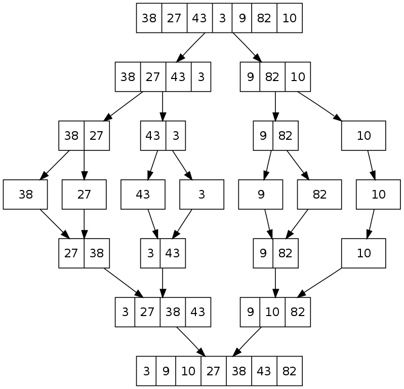
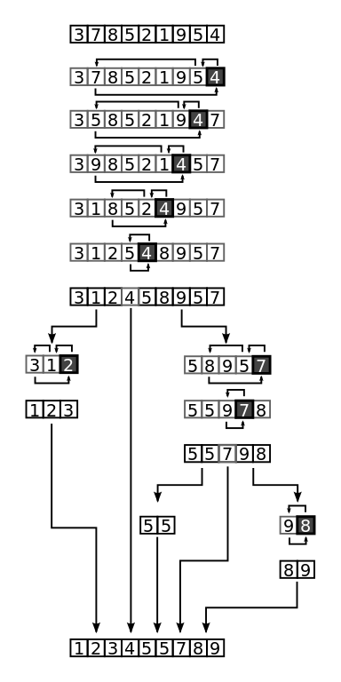

# Sorting

## 종류
 * Selection
 * Bubble
 * Insertion
 * Merge
 * Quick
----

## Selection Sort

## Merge Sort

 * insertion sort보다 속도가 빠르다.
 * 핵심 개념은 "Divide & Conquer"
 * 재귀 방식으로 쉽게 구현

개념 :
 * 정렬하지 않은 n개 sublist로 나누기
 * 정렬된 sublist를 생성하기 위해서 merge

단계 :
 * Divide : 반으로 나누기
 * Conquer : 반으로 나눈 부분에 대해서 sort
 * Merge : 합치기
----

## Array vs. Linked List 

----

## Quick sort

효율적인 정렬 알고리즘.
1959년 영국 컴퓨터 과학자 Tony Hoare가 개발.
현재까지도 가장 일반적으로 사용하는 정렬 알고리즘!
정렬에 드는 추가 메모리를 최소화.
평균 : O(n log n) 
최악 : O(n^2)

개념 : 
 * 2개 sub-array로 나누기 : low와 high
 * sub-array를 정렬

단계 :
 * 대상 array에서 pivot 선정
 * 나누기 : pivot보다 작은 값을 pivot이전으로 위치시키고 pivot보다 큰 값은 pivot 이후에 위치시키기.
 * 재귀 : 