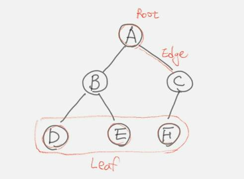

## Tree

## 용어
 * Root : tree의 가장 꼭대기에 있는 node로 parent를 가지지 않는 node
 * Leaf : children을 가지지 않는 node
 * Node : 값 가지며 children node를 가지거나 root를 가질 수 있다
 * Edge : parent node와 child node간의 연결
 * Parent : node의 상위에 있는 node
 * Child : node이 하위에 있는 node
 * Sibling : 동일한 parent를 가지는 node들
 * Subtree : 특정 node 하위에 있는 모든 node들
 * Height : node와 leaf 사이에 edge의 수. root는 height가 0이다.
 * Depth : node에서 root까지의 edge의 수
 * Level : node의 level은 depth에 +1

## 종류
 * Binary Tree
 * AVL
 * Red-black tree

## Binary Tree
 * tree형태의 자료구조
 * 각 node는 최대 2개의 children을 가질 수 있음
   * left, right child
 * 자료구조 자체로 사용되기 보다는
   * binary search tree, binary heap으로 사용
   * 효과적인 search 및 sort
 * 동작
   * Insert
   * Delete
   * Traverse
     * Pre-order, In-order, Post-order
     * Depth-First Order
       * root node에서 가장 멀리 있는 node를 먼저 방문
       * graph의 DFS와 차이점
         * visited한 모든 node를 기억할 필요없음.
         * tree에는 cycle이 없음
       * pre-order의 한 형태
     * Breadth-First Order
       * root node에서 가장 가까운 node를 먼저 방문
       
### AVL
 * Self-balancing tree
   * 검색에 드는 비용을 최소화
   * binary tree 구조를 효과적으로 활용
 * BST insert
   * 재수없으면 한쪽으로 skew한 tree형태가 될 수 있다.
   * binary tree의 효과가 없음
 * 최대한 balance를 유지한 tree를 만들려면!
   * 무엇인가 추가 정보를 가지고 있어야만 할꺼 같다.
   * 어떤 정보를 가지면 좋을까?
 * 추가 정보
   * 각 node 기준으로 자식들이 왼쪽 or 오른쪽으로 얼마나 skew한 상태인지 정보를 저장하고 있으면 되지 않을까?
   * 왼쪽으로 depth가 더 깊다면 -(depth), 오른쪽으로 기울어졌다면 +(depth) 정보를 더 가지도록 하자!
   * 
